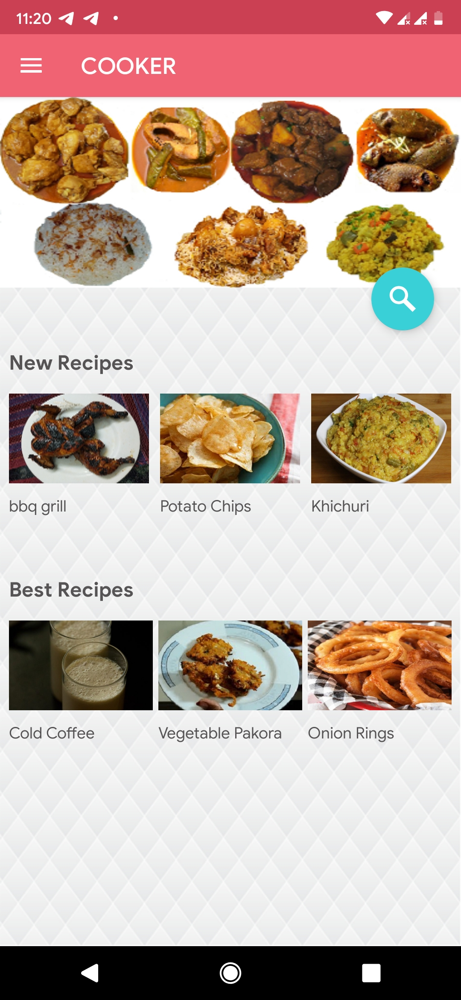
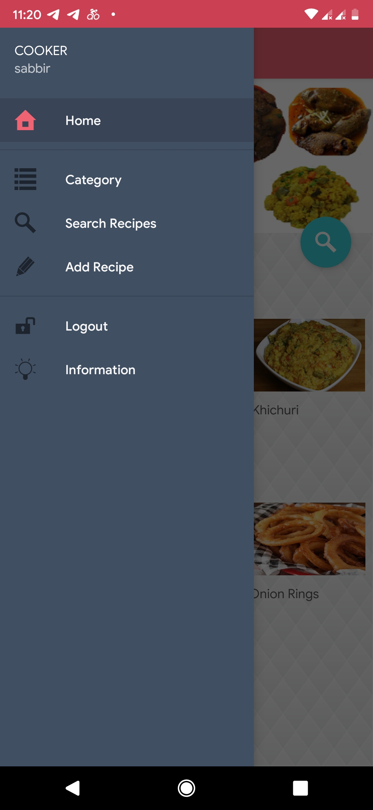
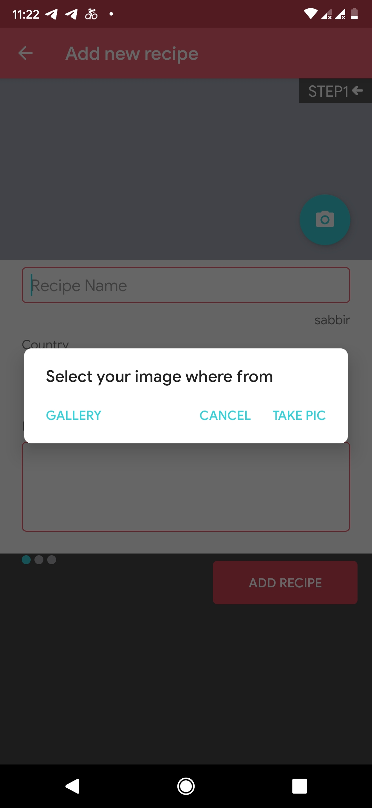
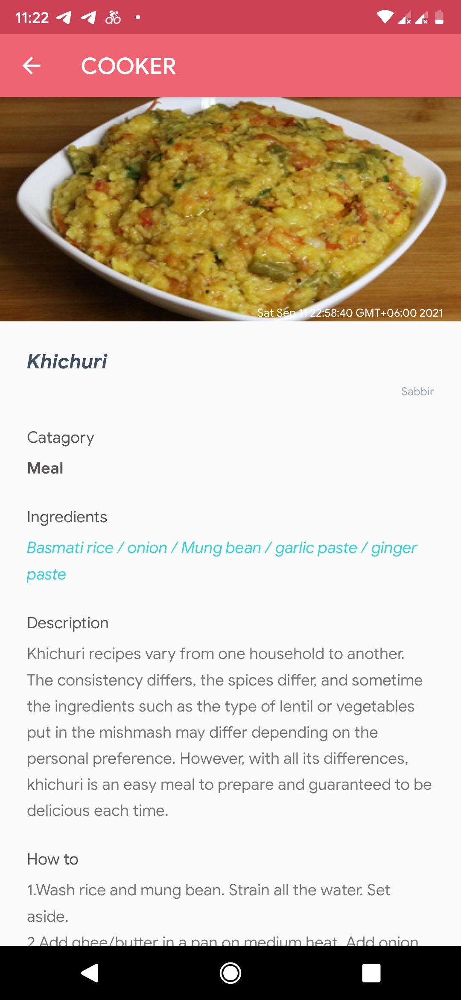

# Cooker
Cooker is basically a recipe app but difference is instead of showing just recipe randomly, it also suggests recipes based on user's choice of ingredients.
Find the full app demonstration [cooker][ck]. For user experience, one can easily install the app through this [APK][apk]

	
 

---

### What does this app do?
"You give ingredients, COOKER will suggest you recepies." - This is the moto of the app. It's for one of those days, when you open your fridge and all on a sudden 
confusing yourself, what to make ! COOKER comes handy here. You simply give ingredients, HOLA !! One can also save their personal recipes also.

----

### App Interface

  
   
  
  	

----

### Libraries & Tools Used
[][as]
[][firebase]
[][java]

  

---

### Setup
For basic setup and graddle problem, follow [this][thiss] procedure shown.

[thiss]: https://github.com/sabbirahmedAUST/Rokto_Sondhan/edit/master/README.md
[firebase]: https://github.com/sabbirahmedAUST/Cooker_App/tree/main/img/firebase.png
[java]: https://github.com/sabbirahmedAUST/Cooker_App/tree/main/img/java.gif
[ck]: https://github.com/sabbirahmedAUST/Cooker_App/tree/main/img/cooker.mp4
[as]: https://github.com/sabbirahmedAUST/Cooker_App/tree/main/img/as.png
[apk]: https://github.com/sabbirahmedAUST/Cooker_App/blob/main/cooker.apk
